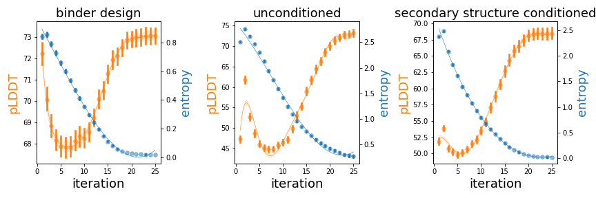

# ProteinWatermark: 

# Enhancing biosecurity in protein design

Compared to the conventional biosecurity regulation method proposed/mentioned in the comments given by Baker and Church ([Protein design meets biosecurity](https://www.science.org/doi/10.1126/science.ado1671), *Science*), adding watermark to the designed protein could achieve several advantages:
- The watermarked protein is not easy to be modified to escape the tracing thus enhancing the biosecurity and IP protection. 
- Using protein/DNA synthesizer to synthesize *de novo* proteins no longer requires researchers upload protein sequence to authority for record thus enhancing the privacy. Instead, with authority assigned private key and strictly controlled synthesizers, researcher is allowed to pass check with correct private key and corresponding watermarked sequences. 
- The watermarked technique can be broadly applied on probabilistic based generative model easily without harming the information sharing process in the community.

## Installation

## Usages

## Examples

### ProteinMPNN & ProGen2 (autoregressive model)

Adding watermarks to autoregressive model is direct. We just need to modify the logit sampled at each step and then sample residue from the modified distribution. Detailed tutorial for modifying ProteinMPNN is available in the [tutorial folder](./tutorials/ProteinMPNN).

Besides, we provide a [notebook](./tutorials/test_example.ipynb) for users to understand the process of watermark detection. We suggest users run the test examples first to ensure the basic environment (pseudo random seed generator) is the same on their own platforms.

Moreover, we also provide a [notebook](./tutorials/test_example.ipynb) for users to understand how the **WatermarkLogitsProcessor** works and the basic robustness of watermarks in a sequence. The examples used in this notebook comes from the [ProGen2](https://github.com/salesforce/progen/tree/485b2ea3db98f8d65d0cd86c2c85ae639b37a678/progen2), how to add watermarks to [transformers](https://huggingface.co/docs/transformers/en/index)-based language model is illustrated in this [folder](./tutorials/ProGen2/).

### Protein Generator (diffusion model)

For the difussion models, we tested it and found that the entropy is really low in later difussion steps. That means the it is very how to effectively add watermarks in the sequences as the sequences are almost deterministic in the difussion models. 

To solve this problem, we can actually run the difussion model for a task many times (around 20,000 times), save all the best generations, and then use these sequences to finetune a protein language model ***(i.e. use another probabilistic model to fit the probability space of a specific design problem***). After that, we can use the watermark framework to add watermarks in the fintuned protein language model and get a watermarked protein design. ***This part is still under construction***, more alternatives could be proposed to solve this problem.

## Issues

Feel free to raise issues!

You can also contact me through my [email](cys@umd.edu)!
