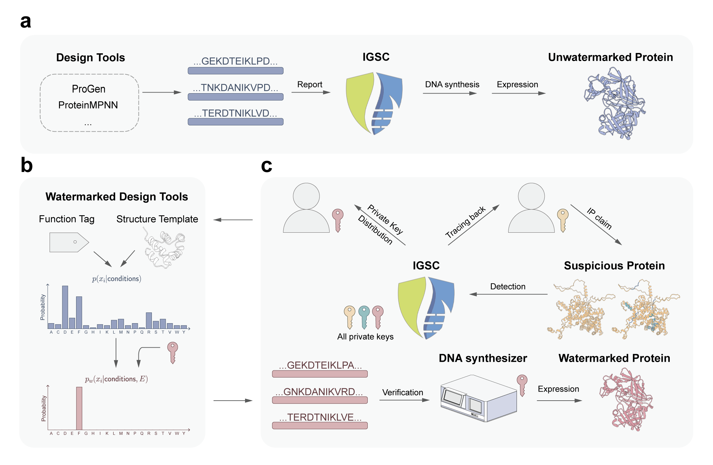

# ProteinWatermark: 
# Enhancing privacy in secured protein design



Compared to the conventional biosecurity regulation method described in the comments given by Baker and Church (Fig1.**a**, [Protein design meets biosecurity](https://www.science.org/doi/10.1126/science.ado1671), *Science*), adding watermarks (Fig1.**b,c**) to the designed protein could achieve two main advantages:

- Privacy. Locally verify a watermarked sequence and then synthesize can protect the sequence information.
- Intellectual Property (IP) protection. Researcher could claim IP of a protein based on his private key.

Besides, it also has advantages:
- Robust tracebility. Which can  deter bad actors in the community to achieve biosecurity.
- User-friendly. It can be easily integrated to autoregressive models. For other models, it can be integrated by knowledge distillation.

## Installation

We encourage users to check the source code to gain much deeper understanding of the watermarking process. 

```shell
# conda create -n your_env python=3.9 (protein watermark was tested on python 3.8 and 3.9 only)
# conda activate your_env 
pip install protein-watermark
```

## Usages

```python
from protein_watermark import (
    WatermarkLogitsProcessor, 
    DeltaGumbel_Reweight, 
    WatermarkDetector
)

delta_wp = WatermarkLogitsProcessor(b"private key", # input your own private key
                                    DeltaGumbel_Reweight(), # specify the reweight function
                                    context_code_length=5, # specify the context code length, which is related to the detection robustness, unbiasedness of watermark. Longer context code leads to worse robustness and better unbiasedness. If context code length is 5, then watermarks can be unbiasedly added 20^5 times at most.
                                   )

watermarked_logits = delta_wp(mode='normal', # normal mode and order-agnoistic mode are supported, for order-agnoistic mode, we need to specify the current position of the sequence.
                              context, # model needs to know the cotext
                              original_logits,
                              current_pos,
                             )
detector = WatermarkDetector(b"private_key",
                             DeltaGumbel_Reweight(),
                             context_code_length,
            								 vocab_size, # the vocabulary size, total number of tokens, can be set as a very large number.
                             )
watermark_score, p_value = detector.detect(input_ids, # sequence after tokenization. shape is (n_sample, length)
                                          )
# see detailed examples below
```

## Examples

### [ProteinMPNN](https://github.com/dauparas/ProteinMPNN) & [ProGen2](https://github.com/salesforce/progen/tree/485b2ea3db98f8d65d0cd86c2c85ae639b37a678/progen2) (autoregressive model)

Adding watermarks to autoregressive model is direct. We just need to modify the logit sampled at each step and then sample residue from the modified distribution. Detailed tutorial for modifying ProteinMPNN is available in the [tutorial folder](./tutorials/ProteinMPNN).

Besides, we provide a [notebook](./tutorials/test_example.ipynb) for users to understand the process of watermark detection. We suggest users run the test examples first to ensure the basic environment (pseudo random seed generator) is the same on their own platforms.

Moreover, we also provide a [notebook](./tutorials/test_example.ipynb) for users to understand how the **WatermarkLogitsProcessor** works and the basic robustness of watermarks in a sequence. The examples used in this notebook comes from the [ProGen2](https://github.com/salesforce/progen/tree/485b2ea3db98f8d65d0cd86c2c85ae639b37a678/progen2), how to add watermarks to [transformers](https://huggingface.co/docs/transformers/en/index)-based language model is illustrated in this [folder](./tutorials/ProGen2/).

### [Protein Generator](https://github.com/RosettaCommons/protein_generator) (diffusion model)

For the diffusion models, we tested it and found that the entropy is really low in later diffusion steps. That means the it is **very hard** to effectively add watermarks in the sequences as the sequences are **almost deterministic** in the diffusion model final steps. 

To solve this problem, in practice, we can run the diffusion model for a task many times (around 20,000 times), save all the best generations, and then use these sequences to finetune a protein language model ***(i.e. knowledge distillation)***. After that, we can use the watermark framework to add watermarks in the fintuned protein language model and get a watermarked protein design. ***This part is still under construction***, more alternatives could be proposed to solve this problem.

## Issues

Feel free to raise issues!

You can also contact me through my [email](cys@umd.edu)!

## Experiments
All the experiments are deposited in the [Experiments folder](./Experiments), you can reproduce the results after setting up your own watermarked ProteinMPNN model.

## Citation

```tex
@article{ProteinWatermark,
  title={Enhancing Biosecurity with Watermarked Protein Design},
  author={Chen, Yanshuo and Hu, Zhengmian and Wu, Yihan and Chen, Ruibo and Jin, Yongrui and Chen, Wei and Huang, Heng},
  journal={bioRxiv},
  pages={2024--05},
  year={2024},
  publisher={Cold Spring Harbor Laboratory}
}
```